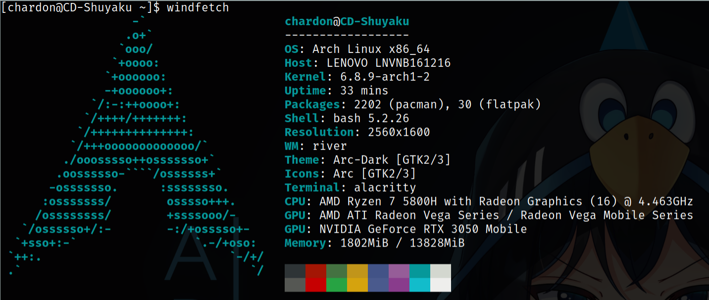

# Windfetch

A command-line system information tool written in bash. Fork of [Neofetch](https://github.com/dylanaraps/neofetch).

Work in progress.

[Repository on Codeberg](https://codeberg.org/chardon_cs/windfetch)

## At a glance



## Build

To merge the source code into a monolithic executable bash file, use:

```bash
make 
```
## Roadmap

| Task                      | Status         |
|---------------------------|----------------|
| Rebrand to Windfetch      | ✅ Done        |
| WM detection fix          | ✅ Done        |
| Nerd fonts support        | 🏗️ In progress |
| Finish renaming in source | 🏗️ In progress |
| More to come...           |                |

